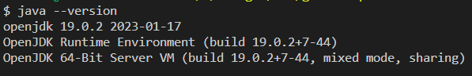

## Introduction à Java - Écrire votre premier programme Java
Dans cette leçon, nous allons apprendre à écrire et à exécuter un programme Java simple qui affichera le classique "Hello, World!" à l'écran.

### Étape 1 : Installation de l'environnement de développement Java
Avant de commencer, assurez-vous que vous avez Java Development Kit (JDK) installé sur votre ordinateur. Pour vérifier tapez la commande suivante dans un terminal:

```bash
java --version
```
Vous obtenez un résultat semblable au suivant

Vous pouvez télécharger la dernière version du JDK depuis le site officiel d'Oracle : [Télécharger le JDK](https://www.oracle.com/java/technologies/javase-downloads.html)


Étape 2 : Configuration de votre environnement de développement
Windows
Ouvrez le Bloc-notes (Notepad) ou un éditeur de texte de votre choix.

Écrivez le code Java suivant dans votre éditeur de texte :

java
Copy code
public class HelloWorld {
    public static void main(String[] args) {
        System.out.println("Hello, World!");
    }
}
Enregistrez ce fichier avec l'extension .java. Par exemple, HelloWorld.java.

Ouvrez l'invite de commande (CMD) et utilisez la commande cd pour naviguer jusqu'au répertoire où vous avez enregistré votre fichier Java.

Compilez le programme en utilisant la commande :

Copy code
javac HelloWorld.java
Exécutez le programme en utilisant la commande :

Copy code
java HelloWorld
